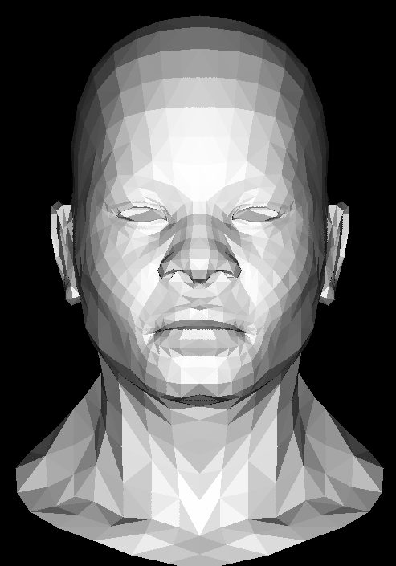

# Tiny renderer

The image below was completely rendered using nothing more than an HTML canvas (in 2D mode, no WebGL) and mathematics.

This is my Javascript implementation of Dimitry Sokolov's [Tiny renderer](https://github.com/ssloy/tinyrenderer). My version currently implements line drawing, triangle rasterization, back face culling and z buffer.

